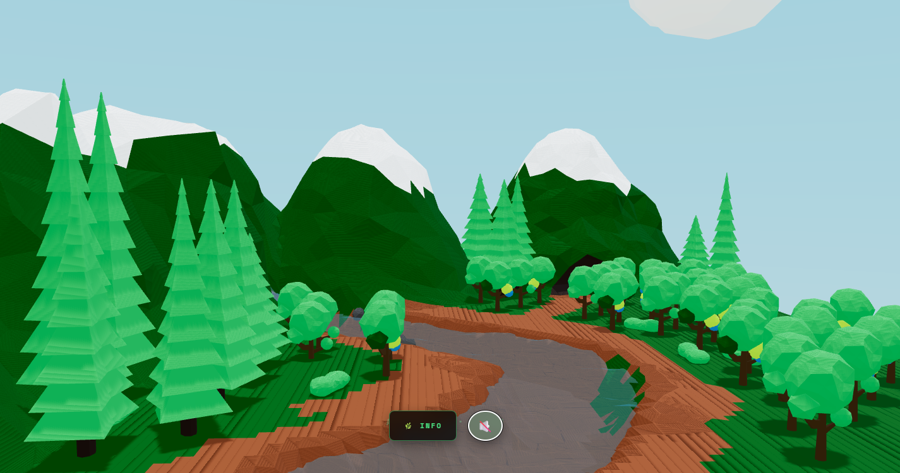

# Ecosistema de un Bosque



Aplicación web 3D interactiva desarrollada como proyecto académico para ilustrar los conceptos de la **Teoría General de Sistemas** de Ludwig von Bertalanffy, utilizando un bosque low-poly como modelo de sistema abierto, complejo y dinámico.

---

## Tecnologías

* **React 18** — Interfaz y manejo de estado
* **Three.js / React Three Fiber** — Renderizado 3D
* **@react-three/drei** — OrbitControls, useGLTF, Center
* **Vite** — Bundler y servidor de desarrollo

---

## Instalación

```bash
git clone https://github.com/jheisonGZ/bosque-_lowpoly.git
cd bosque-_lowpoly
npm install
npm run dev
```

Abre `http://localhost:5173` en el navegador.

---

## Estructura

```
public/
  models/lowpoly.glb     # Modelo 3D
  audio/audio.mp3        # Audio ambiental
src/
  App.jsx                # Componente principal
index.html
```

---

## Funcionalidades

* Exploración 3D libre con rotación y zoom
* Panel informativo con 12 propiedades sistémicas del ecosistema
* Diseño responsive: acordeón en móvil, grid en desktop
* Audio ambiental con control de mute
* Pantalla de carga animada

---

## Referencias

* Von Bertalanffy, L. (1968).  *General System Theory* . George Braziller.
* Odum, H. T. (1983).  *Systems Ecology* . Wiley.

---

*Teoría General de Sistemas — 2024*

Readme **·** **MD**

Copiar

`<span><span class="token token title">#</span></span>`
